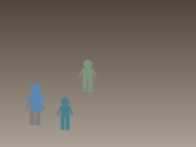

# Person Detection & Tracking: Scratch vs. Transfer Learning

A complete two-version person detection and tracking system built for Zewail City Computer Vision Assignment 4.

| Version | Approach | Detection | Tracking | Hardware |
|---------|----------|-----------|----------|----------|
| **V1** | From Scratch | MOG2 background subtraction + contour filter | Custom Centroid/IoU tracker (pure NumPy) | CPU |
| **V2** | Transfer Learning | YOLOv8n (COCO-pretrained) | ByteTrack | T4 GPU |

Both versions run on **[Modal.com](https://modal.com)** — all heavy compute in the cloud, no local GPU required.

---

## Demo — Before & After Tracking

### V1: MOG2 + Centroid Tracker

| Raw Input | After Detection & Tracking |
|-----------|---------------------------|
|  |  |

### V2: YOLOv8n + ByteTrack

| Raw Input | After Detection & Tracking |
|-----------|---------------------------|
|  |  |

> The synthetic video contains 4 person silhouettes (head + torso + arms + legs) moving on a gradient background. Each person is independently tracked and assigned a persistent colour-coded ID.

---

## Directory Structure

```
person-tracking/
├── src/
│   ├── utils.py                 # shared: video I/O, draw_tracks, compute_iou, evaluate_tracking
│   ├── v1_scratch/
│   │   ├── detector.py          # MOG2Detector  (background subtraction + morphology + contour)
│   │   └── tracker.py           # CentroidTracker (IoU + centroid distance, Hungarian matching)
│   └── v2_transfer/
│       ├── detector.py          # YOLOv8Detector (ultralytics, person class only)
│       └── tracker.py           # ByteTrackWrapper (ultralytics .track() + bytetrack.yaml)
├── modal_app/
│   ├── common.py                # shared Modal image + volume
│   ├── modal_v1_scratch.py      # V1 Modal function (CPU worker)
│   ├── modal_v2_transfer.py     # V2 Modal function (T4 GPU)
│   ├── modal_run_all.py         # run V1 + V2 in parallel
│   └── modal_execute_all.py     # execute notebooks + compile LaTeX on Modal
├── notebooks/
│   ├── v1_scratch.ipynb         # fully-executed V1 walkthrough (with outputs)
│   └── v2_transfer.ipynb        # fully-executed V2 walkthrough (with outputs)
├── report/
│   ├── report.tex               # complete LaTeX report
│   ├── report.pdf               # compiled PDF
│   ├── compile.sh               # compile script (runs generate_figures.py first)
│   ├── generate_figures.py      # auto-generate all pipeline + result figures
│   └── figures/                 # PNG figures (auto-generated)
├── tests/
│   ├── test_v1.py               # 6 tests — all pass without GPU
│   └── test_v2.py               # 3 tests — V2 tests skip if ultralytics unavailable
└── outputs/                     # runtime output videos + GIFs (gitignored)
    ├── v1_output.mp4
    ├── v2_output.mp4
    ├── v1_before.gif
    ├── v1_after.gif
    ├── v2_before.gif
    └── v2_after.gif
```

---

## Quick Start

### 1. Install dependencies

```bash
pip install -r requirements.txt
```

### 2. Run everything on Modal (recommended)

```bash
# Authenticate once
modal setup

# Execute both notebooks + compile PDF — runs on T4 GPU in the cloud
modal run modal_app/modal_execute_all.py
```

This downloads executed notebooks, `report/report.pdf`, annotated videos, and before/after GIFs to your local machine.

### 3. Run individual pipelines

```bash
# V1 — CPU worker
modal run modal_app/modal_v1_scratch.py

# V2 — T4 GPU
modal run modal_app/modal_v2_transfer.py
```

---

## Running Tests Locally

```bash
pytest tests/ -v
# 7 passed, 2 skipped (V2 skips when ultralytics not installed locally)
```

---

## Compiling the Report Locally

Requires `pdflatex` (`sudo apt install texlive-latex-extra`).

```bash
bash report/compile.sh
```

Or compile it on Modal (no local LaTeX needed):

```bash
modal run modal_app/modal_execute_all.py
```

---

## Regenerating Notebooks

```bash
python gen_notebooks.py   # writes clean .ipynb files
modal run modal_app/modal_execute_all.py   # executes them on Modal
```

---

## Key Results

| Method | Hardware | Speed | Latency |
|--------|----------|-------|---------|
| V1: MOG2 + Centroid | CPU | ~100+ FPS | ~5–10 ms |
| V2: YOLOv8n + ByteTrack | CPU | ~10–20 FPS | ~50–100 ms |
| V2: YOLOv8n + ByteTrack | GPU T4 | ~80–120 FPS | ~8–12 ms |

V1 is significantly faster on CPU due to pure-numpy implementation.
V2 is more accurate on real-world footage with unconstrained lighting and occlusion.

---

## Dependencies

- Python 3.10+
- `opencv-python-headless` — MOG2, contour detection, video I/O
- `ultralytics` — YOLOv8n + ByteTrack (auto-downloads `yolov8n.pt` ~6 MB on first use)
- `torch` — required by ultralytics; CPU build sufficient for local testing
- `modal` — cloud execution (free tier available)
- `scipy` — Hungarian assignment in CentroidTracker (falls back to greedy if unavailable)
